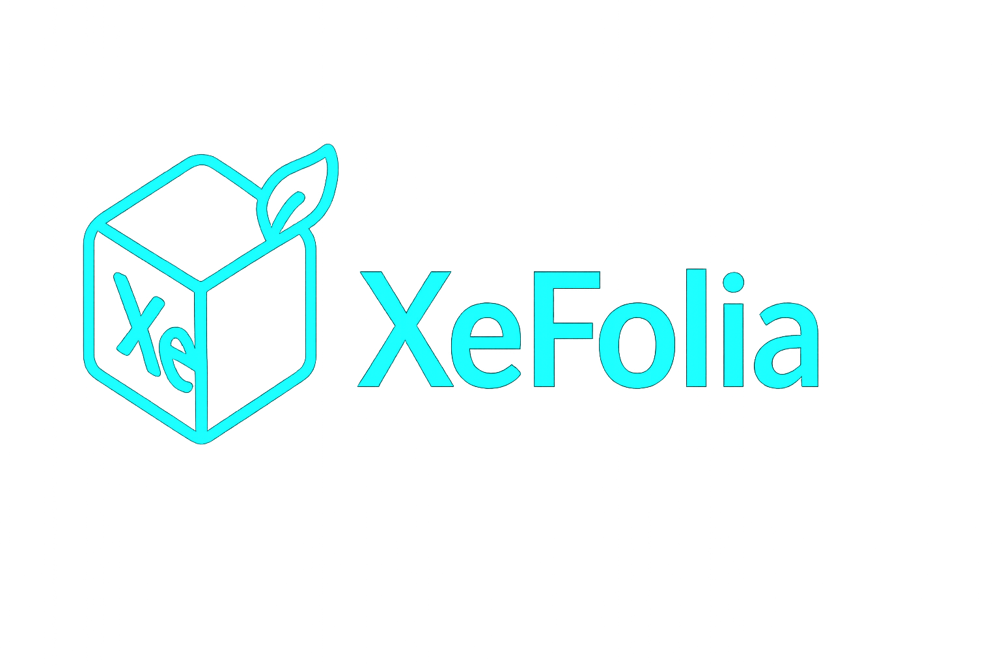

<div>
    
    <br /><br />
    <p>Fork of <a href="https://github.com/PaperMC/Folia/tree/dev/1.21.4?tab=readme-ov-file">Folia-paper</a> Với Tối ưu hệ thống đa luồng theo vùng.

## Features

 - Tối ưu hệ thống tạo chunks
 - Tối ưu / làm lại hệ thống xray 
 - Sẽ hỗ trợ plugin bukkit trong tương lai

## Download
Tất cả phiên bản Đều ở đây  [release](https://github.com/Khoasoma/XenonFolia/releases), Hoặc tự build theo hướng dẫn ở [đây](./README.md#Build).

## Build
Để Build được paperclip jar dùng cmd dưới đây. Build xong sẽ tìm thấy jar ở build/libs (Note: Cần jdk21)
 ```shell
 ./gradlew applyPatches && ./gradlew createMojmapPaperclipJar
```
## API
Nothing
